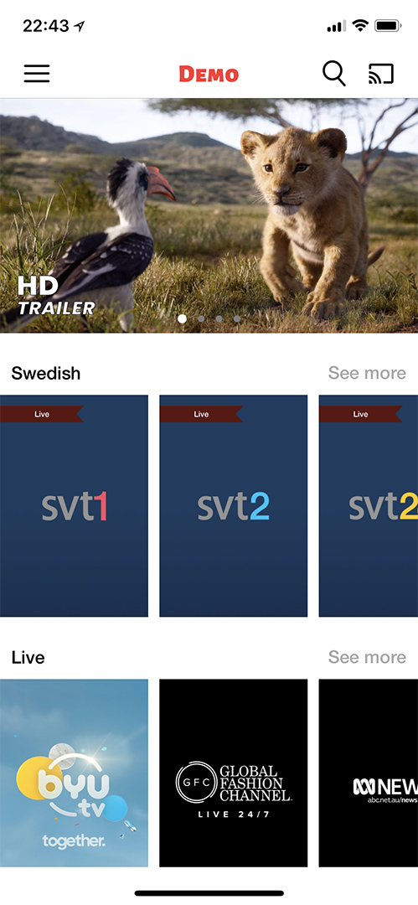
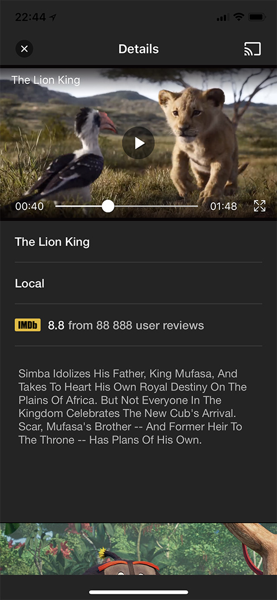
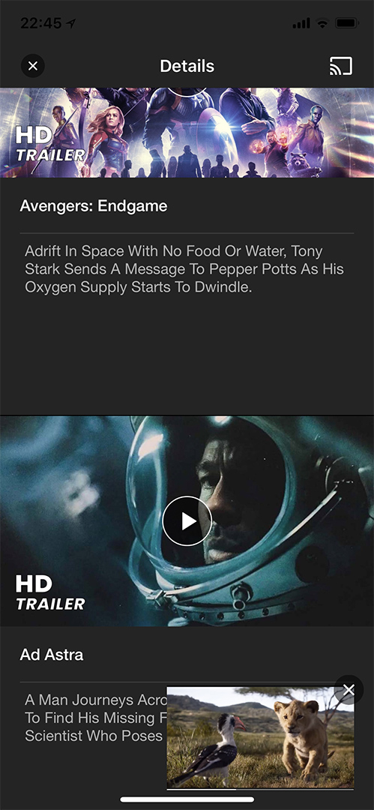

<p align="center" >
  
</p>


[](https://cocoapods.org/pods/FWPlayer)
[](https://github.com/Carthage/Carthage)
[](https://cocoapods.org/pods/FWPlayer)
[](https://cocoapods.org/pods/FWPlayer)

# FWPlayer
A video player SDK for iOS, it is based on AVPlayer. 

## Features
- [x] Supports horizontal and vertical playback
- [x] Supports auto-rotating screen playback
- [x] Supports the full-screen and mini-player playback
- [x] Supports mini-player position to drag freely
- [x] Supports the network and local video playback
- [x] Supports full-screen lock
- [x] Supports playback while downloading (Media Cache)
- [x] Supports vertical slide on the left side of the screen to adjust the brightness
- [x] Supports the vertical slide on the right side of the screen to adjust the volume
- [x] Supports gesture swipe fast-forward and rewind
- [x] Supports drag slider fast-forward and rewind
- [x] Supports direct jump to a point in the timeline to play
- [x] Supports multiple video formats
- [x] Supports UITableView playback
- [x] Supports UICollectionView playback
- [x] Supports UIScrollView playback
- [x] Supports background playback
- [x] Supports play sound in silent mode by default
- [x] Supports speed rate playback (0.5x, 1.0x, 1.25x, 1.5x, 2.0x)
- [x] Supports custom player view
- [x] Supports advertising view
- [x] Supports adding Http headers and other options to AVURLAsset
- [x] Supports iPhone X and above
- [x] Supports iOS 13 +
- FFmpeg is not supported because OpenGL ES was deprecated in iOS 12

## Requirements
- iOS 10 +
- Xcode 11 +

## Installation

You can install FWPlayer SDK in several ways:

1. [CocoaPods](#cocoapods)
2. [Carthage](#carthage)
3. [Manual Installation](#manual-installation)

### CocoaPods

[CocoaPods](http://www.cocoapods.org/) is an easy way to install FWPlayer.

1. Add following pod to your `Podfile`:

```ruby
platform :ios, '10.0'

target 'Your App' do
    pod 'FWPlayer'
end
```

2. Then, run the following command:
```bash
$ pod install
```

3. Switch over to `Build Phases` and add a `New Run Script Phase` by clicking the `+` in the top left of the editor. Add the following command to solve the issue of [App Store submission](http://www.openradar.me/radar?id=6409498411401216).
```bash
bash "${BUILT_PRODUCTS_DIR}/${FRAMEWORKS_FOLDER_PATH}/FWPlayerCore.framework/strip-frameworks.sh"
```

### Carthage

Since FWPlayer SDK is distributed as a binary, you need to use custom `binary` rule in your `Cartfile`.

1. Add following to your `Cartfile`:

```
binary "https://raw.githubusercontent.com/FoksWang/FWPlayer/master/Carthage/FWPlayer.json" ~> 1.0.13
```

2. Fetch framework by running:

```bash
$ carthage update --platform iOS
```

### Manual Installation

1. Add the FWPlayer framework to `Embedded Binaries` for your target:

```
FWPlayerCore.framework
```

2. Make sure you link with the following `Linked Frameworks and Libraries`:

```
FWPlayerCore.framework
```

## Usage

### Normal Style
**Objective-C**
```objective-c
FWAVPlayerManager *playerManager = [[FWAVPlayerManager alloc] init];
self.player = [FWPlayerController playerWithPlayerManager:playerManager containerView:self.containerView];
self.player.controlView = self.controlView;
```

**Swift**
```swift
private var player: FWPlayerController?

private lazy var containerView: UIImageView = {
	let imageView = UIImageView()
	imageView.setImageWithURLString(coverImageUrl, placeholder: UIImage(named: "placeholder"))
	return imageView
}()

private lazy var controlView: FWPlayerControlView =  {
	let view = FWPlayerControlView()
	view.fastViewAnimated = true
	view.autoHiddenTimeInterval = 5.0
	view.autoFadeTimeInterval = 0.5
	view.prepareShowLoading = true
	view.prepareShowControlView = true
	return view
}()

let playerManager = FWAVPlayerManager()
playerManager.isEnableMediaCache = false

// Setup player
self.player = FWPlayerController(playerManager: playerManager, containerView: self.containerView)
self.player?.controlView = self.controlView

// Setup continue playing in the background
self.player?.pauseWhenAppResignActive = true

self.player?.orientationWillChange = { [weak self] (player, isFullScreen) in
	self?.setNeedsStatusBarAppearanceUpdate()
}

// Finished playing
self.player?.playerDidToEnd = { [weak self] (asset) in
	guard let strongSelf = self else {
		return
	}
	strongSelf.player?.currentPlayerManager.replay!()
	strongSelf.player?.playTheNext()
	if strongSelf.player?.isLastAssetURL == false {
		strongSelf.controlView.showTitle("Video Title", coverURLString: strongSelf.kVideoCover, fullScreenMode: .landscape)
	} else {
		strongSelf.player?.stop()
	}
}

self.player?.assetURLs = self.assetURLs

```

#### To play the next or previous video, just set:
**Objective-C**
```objective-c
self.player.assetURLs = self.assetURLs;
```

**Swift**
```swift
self.player!.assetURLs = self.assetURLs
```

- To play the next video, please call method `playTheNext`
- To play the previous video, please call method `playThePrevious`
- To play the video from the asset list, please call method `playTheIndex:index`

#### For example, play the next video:
**Objective-C**
```objective-c
if (!self.player.isLastAssetURL) {
    [self.player playTheNext];
    [self.controlView showTitle:@"Video title" coverURLString:kVideoCover fullScreenMode:FWFullScreenModeAutomatic];
} else {
    NSLog(@"No more videos");
}
```

**Swift**
```swift
if self.player!.isLastAssetURL == false {
    self.player!.playTheNext()
    self.controlView.showTitle("Video title", coverURLString: kVideoCover, fullScreenMode: .automatic)
} else {
    print("No more videos")
}
```

### Quick demo for Normal Style
**Swift**
```swift
class ViewController: UIViewController {
    
    private let kVideoCover = "https://github.com/FoksWang/FWPlayer/blob/master/Example/FWPlayer/Images.xcassets/Common/cover_image_placeholder.imageset/cover_image_placeholder.jpg?raw=true"
    private var player: FWPlayerController?
    private lazy var containerView: UIImageView = {
        let imageView = UIImageView()
        let color = UIColor(red: 220.0/255.0, green: 220.0/255.0, blue: 220.0/255.0, alpha: 1)
        let placeholderImage = FWUtilities.image(with: color, size: CGSize(width: 1, height: 1))
        imageView.setImageWithURLString(kVideoCover, placeholder: placeholderImage)
        return imageView
    }()
    
    private lazy var controlView: FWPlayerControlView = {
        let view = FWPlayerControlView()
        view.fastViewAnimated = true
        view.autoHiddenTimeInterval = 5.0
        view.autoFadeTimeInterval = 0.5
        view.prepareShowLoading = true
        view.prepareShowControlView = true
        return view
    }()
    
    private lazy var playButton: UIButton = {
        var button = UIButton(type: .custom)
        button.setImage(FWUtilities.imageNamed("FWPlayer_all_play"), for: .normal)
        button.addTarget(self, action: #selector(playButtonClick), for: .touchUpInside)
        return button
    }()
    
    private lazy var nextButton: UIButton = {
        var button = UIButton(type: .system)
        button.setTitle("Next", for: .normal)
        button.addTarget(self, action: #selector(nextButtonClick), for: .touchUpInside)
        return button
    }()
    
    private var assetIndex = 0
    private lazy var assetURLs: Array<URL> = {
        var assetList = [
            URL(string: "https://svt1-b.akamaized.net/se/svt1/master.m3u8")!,
            URL(string: "https://svt1-b.akamaized.net/se/svt2/master.m3u8")!,
            URL(string: "https://www.radiantmediaplayer.com/media/bbb-360p.mp4")!,
            URL(string: "http://commondatastorage.googleapis.com/gtv-videos-bucket/sample/ElephantsDream.mp4")!,
            URL(string: "http://commondatastorage.googleapis.com/gtv-videos-bucket/sample/ForBiggerBlazes.mp4")!,
            URL(string: "http://commondatastorage.googleapis.com/gtv-videos-bucket/sample/Sintel.mp4")!,
            URL(string: "http://commondatastorage.googleapis.com/gtv-videos-bucket/sample/SubaruOutbackOnStreetAndDirt.mp4")!,
            URL(string: "http://commondatastorage.googleapis.com/gtv-videos-bucket/sample/TearsOfSteel.mp4")!,
            URL(string: "http://commondatastorage.googleapis.com/gtv-videos-bucket/sample/VolkswagenGTIReview.mp4")!,
            URL(string: "http://commondatastorage.googleapis.com/gtv-videos-bucket/sample/WeAreGoingOnBullrun.mp4")!,
            URL(string: "http://commondatastorage.googleapis.com/gtv-videos-bucket/sample/WhatCarCanYouGetForAGrand.mp4")!,
        ]
        return assetList
    }()
    
    override func viewDidLoad() {
        super.viewDidLoad()
        // Do any additional setup after loading the view.
        
        self.view.backgroundColor = .white
        self.view.addSubview(self.containerView)
        self.containerView.addSubview(self.playButton)
        self.view.addSubview(self.nextButton)
        
        let version = FWAVPlayerManager.getVersionNumber()
        let build = FWAVPlayerManager.getBuildNumber()
        print("version = \(String(describing: version)), build = \(String(describing: build))")
        
        let playerManager = FWAVPlayerManager()
        // Playback speed,0.5...2
        playerManager.rate = 1.0
        
        // Enable media cache for assets
        playerManager.isEnableMediaCache = false
        
        // Setup player
        self.player = FWPlayerController(playerManager: playerManager, containerView: self.containerView)
        self.player!.controlView = self.controlView
        // Setup continue playing in the background
        self.player!.pauseWhenAppResignActive = true
        
        self.player!.orientationWillChange = { [weak self] (player, isFullScreen) in
            guard let self = self else { return }
            self.setNeedsStatusBarAppearanceUpdate()
        }
//        playerManager.isMuted = true
        
        // Finished playing
        self.player!.playerDidToEnd = { [weak self] (asset) in
            guard let strongSelf = self else {
                return
            }
            strongSelf.player!.currentPlayerManager.replay!()
            strongSelf.player!.playTheNext()
            if strongSelf.player!.isLastAssetURL == false {
                strongSelf.controlView.showTitle("Video Title", coverURLString: strongSelf.kVideoCover, fullScreenMode: .landscape)
            } else {
                strongSelf.player!.stop()
            }
        }
        self.player!.assetURLs = self.assetURLs
    }
    
    override func viewWillAppear(_ animated: Bool) {
        super.viewWillAppear(animated)
        self.player?.isViewControllerDisappear = false
    }
    
    override func viewWillDisappear(_ animated: Bool) {
        super.viewWillDisappear(animated)
        self.player?.isViewControllerDisappear = true
    }
    
    override func viewWillLayoutSubviews() {
        super.viewWillLayoutSubviews()
        
        var w: CGFloat = UIScreen.main.bounds.size.width
        var h = w * 9 / 16
        var x: CGFloat = 0
        var y: CGFloat = (UIScreen.main.bounds.size.height - h) / CGFloat(2.0)
        self.containerView.frame = CGRect(x: x, y: y, width: w, height: h)
        
        w = 44
        h = w
        x = (self.containerView.frame.width - w) / 2
        y = (self.containerView.frame.height - h) / 2
        self.playButton.frame = CGRect(x: x, y: y, width: w, height: h)
        
        w = 100;
        h = 30;
        x = (self.view.frame.width - w ) / 2
        y = self.containerView.frame.maxY + 50
        self.nextButton.frame = CGRect(x: x, y: y, width: w, height: h)
    }
    
    @IBAction func playButtonClick() {
        print("playButtonClick")
        self.player!.playTheIndex(assetIndex)
        self.controlView.showTitle("Video title 1", coverURLString: kVideoCover, fullScreenMode: .automatic)
    }
    
    @IBAction func nextButtonClick() {
        print("nextButtonClick")
        assetIndex += 1
        if assetIndex > assetURLs.count - 1 {
            assetIndex = assetURLs.count - 1
        }
        self.player!.playTheIndex(assetIndex)
        self.controlView.showTitle("Video title 2", coverURLString: kVideoCover, fullScreenMode: .automatic)
    }
    
    override var preferredStatusBarStyle: UIStatusBarStyle {
        if self.player != nil && self.player!.isFullScreen {
            return .lightContent
        } else {
            return .default
        }
    }
    
    override var prefersStatusBarHidden: Bool {
        // Support only iOS 9 and later, so return false.
        return false
    }
    
    override var preferredStatusBarUpdateAnimation: UIStatusBarAnimation {
        return .slide
    }
    
    override var shouldAutorotate: Bool {
        return self.player?.shouldAutorotate ?? false
    }
    
    override var supportedInterfaceOrientations: UIInterfaceOrientationMask {
        if self.player != nil && self.player!.isFullScreen {
            return .landscape
        }
        return .portrait
    }
}
```

### List Style
**Objective-C**
```objective-c
FWAVPlayerManager *playerManager = [[FWAVPlayerManager alloc] init];
self.player = [FWPlayerController playerWithScrollView:self.tableView playerManager:playerManager containerViewTag:tag];
self.player.controlView = self.controlView;
```

**Swift**
```swift
let playerManager = FWAVPlayerManager()
self.player = FWPlayerController(scrollView: tableView, playerManager: playerManager, containerViewTag: tag)
self.player!.controlView = self.controlView
```

- Your custom playerManager must conform to `FWPlayerMediaPlayback` protocol.
- Your custom controlView must conform to `FWPlayerMediaControl` protocol.

### Must implement in the ViewController if video rotating
**Objective-C**
```objective-c
- (BOOL)shouldAutorotate {
    return player.shouldAutorotate;
}
```

**Swift**
```swift
override var shouldAutorotate: Bool {
  return self.player?.shouldAutorotate ?? false
}
```

### If use playback while downloading (Media Cache)

The function `playback while downloading (Media Cache)` does **NOT** support m3u8, it is commonly used for MP4.

1. Setup `isEnableMediaCache`

**Objective-C**
```objc
playerManager.isEnableMediaCache = YES;
```

**Swift**
```swift
playerManager.isEnableMediaCache = true
```

2. Setup `NSAppTransportSecurity` in your `Info.plist`
```plist
<key>NSAppTransportSecurity</key>
<dict>
    <key>NSAllowsArbitraryLoads</key>
    <true/>
</dict>
```

## Demonstration


#### ScreenShots
&nbsp;&nbsp;&nbsp;&nbsp;&nbsp;&nbsp;&nbsp;&nbsp;

#### Video
[](https://youtu.be/syU0dPZ3bZo)

## References
- https://github.com/Bilibili/ijkplayer
- https://github.com/changsanjiang/SJVideoPlayer
- https://github.com/renzifeng/ZFPlayer
- https://github.com/vitoziv/VIMediaCache
- https://github.com/ChangbaDevs/KTVHTTPCache

## Author

(Foks)Hui Wang, foks.wang@gmail.com

## License

FWPlayer is available under the MIT license. See the LICENSE file for more info.
